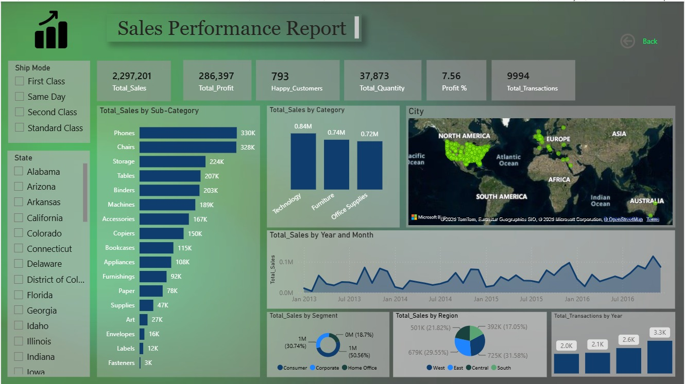

# Sales-Performance-PowerBI-Dashboard
Interactive Sales Performance Dashboard built in Power BI using the Superstore Sales dataset. Features DAX measures, Power Query transformations, KPI reporting, and interactive visualizations for sales, profit, customer, and regional analysis.

# 📊 Sales Performance Dashboard | Power BI

## 📌 Project Overview

This project showcases an interactive **Sales Performance Dashboard** developed using **Power BI** to analyze sales performance, profitability, customer behavior, product performance, and regional trends.

The dashboard provides business users with key performance indicators (KPIs) and interactive visualizations to support strategic decision-making.

---

## 🖼 Dashboard Preview

---

## 🎯 Business Objectives

- Monitor overall business performance.
- Track sales, profit, and transaction volume.
- Analyze product category and sub-category performance.
- Compare regional sales distribution.
- Understand customer purchasing behavior.
- Monitor monthly sales trends.
- Evaluate shipping methods.

---

## 📊 Key KPIs

| KPI | Value |
|------|------|
| Total Sales | 2.29M |
| Total Profit | 286K |
| Happy Customers | 793 |
| Total Quantity Sold | 37.8K |
| Profit Percentage | 7.56% |
| Total Transactions | 9,994 |

---

## 📈 Dashboard Features

✔ Executive KPI Cards

✔ Sales by Category

✔ Sales by Sub-Category

✔ Monthly Sales Trend

✔ Geographic Sales Map

✔ Sales by Segment

✔ Sales by Region

✔ Transactions by Year

✔ Interactive Filters

- Ship Mode
- State

---

## 🛠 Tools Used

- Power BI Desktop
- Power Query
- DAX
- Microsoft Excel

---

## 📈 Key Insights

- Technology is the highest revenue-generating category.
- Phones and Chairs are the top-performing products.
- Consumer segment contributes the largest share of sales.
- Sales show consistent year-over-year growth.
- West region records the highest sales performance.

---

## 💼 Skills Demonstrated

- Data Cleaning
- Data Transformation
- Data Modeling
- DAX Measures
- Power Query
- Dashboard Development
- KPI Reporting
- Sales Analytics
- Business Intelligence
- Data Visualization

---

## 📂 Files Included

- Sales_Performance_Report.pbix
- Dashboard.png
- README.md

---

## 👨‍💻 Author

**Abhay Dubey**

Aspiring Data Analyst

Power BI | SQL | Excel | Python
